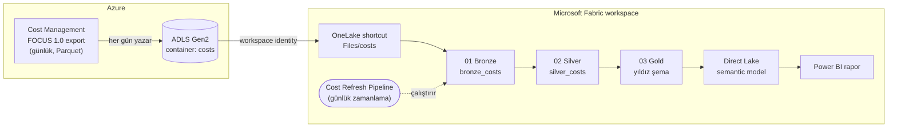

# Azure Cost → Microsoft Fabric

Azure aboneliğinizdeki **tüm servislerin maliyet verisini** her gün otomatik olarak Microsoft Fabric'e taşıyan ve Power BI ile raporlanabilir hâle getiren, uçtan uca ve adım adım anlatılmış bir başlangıç reposu.

> Bu repo, `microsoft/frontier-fabric-agentops-rvas` reposundaki geniş "agent observability" çözümünden **yalnızca maliyet (cost) hattı** çıkarılarak, sadeleştirilerek ve düzeltilerek hazırlanmıştır. Ayrıntılar için [Orijinal repodan farklar](#orijinal-repodan-farklar) bölümüne bakın.

## Mimari



| Katman | Nerede | Ne yapar |
|---|---|---|
| **Kaynak** | Azure Cost Management | Abonelikteki tüm servislerin maliyetini FOCUS 1.0 standardında, günlük olarak Parquet dosyası halinde storage'a yazar |
| **Landing** | ADLS Gen2 (`costs` container) | Export dosyalarının ham hâli |
| **Shortcut** | Fabric Lakehouse `Files/costs` | Veriyi kopyalamadan OneLake'ten erişim |
| **Bronze** | `bronze_costs` Delta tablosu | Ham satırlar + dosya/run lineage kolonları |
| **Silver** | `silver_costs` Delta tablosu | Her fatura dönemi için **en güncel export run'ı**, tipli kolonlar, ayrıştırılmış etiketler |
| **Gold** | `gold_*` Delta tabloları | Power BI için yıldız şema (fact + boyutlar + aylık özet) |
| **Model** | Direct Lake semantic model | Hazır DAX ölçüleri (MTD, YTD, MoM, tasarruf…) |

## Hızlı başlangıç

### A) Yerel demo — Azure/Fabric gerekmez (2 dakika)

Tüm akışı ücretsiz olarak bilgisayarınızda görmek için:

```powershell
./local-demo/run-demo.ps1
```

Script her adımda durup ne yaptığını açıklar: örnek FOCUS export'u üretir → Bronze/Silver/Gold'u pandas ile çalıştırır → Power BI raporunun HTML önizlemesini açar. Ayrıntılar: [docs/demo-adim-adim.md](docs/demo-adim-adim.md).

### B) Gerçek kurulum — Azure + Fabric

Ön koşullar: Azure CLI (`az login`), Python 3.10+, PowerShell 7, **aktif** bir Fabric kapasitesi (F2+ veya Trial) ve abonelikte *Cost Management Contributor* + *Owner/User Access Administrator* (rol ataması için) yetkileri.

```powershell
# 1) Storage + günlük FOCUS export
./scripts/01-deploy-azure.ps1 -EnvironmentName demo -Location westeurope

# 2) Export'u hemen çalıştır (+ son 3 ayı geriye doldur)
./scripts/02-run-cost-export.ps1 -BackfillMonths 3

# 3) Fabric: workspace, bağlantı, lakehouse, shortcut, notebook, pipeline, semantic model
python -m pip install -r scripts/requirements.txt
python scripts/setup_fabric.py --capacity-name <kapasite-adi> --schedule-time 06:00
```

Her adımın ne yaptığı ve nedenini `docs/` altındaki rehberlerde bulabilirsiniz.

## Dokümantasyon

| # | Rehber | İçerik |
|---|---|---|
| 1 | [Mimari](docs/01-mimari.md) | Bileşenler, veri akışı, tasarım kararları, FOCUS nedir |
| 2 | [Azure Cost Export](docs/02-azure-cost-export.md) | Bicep, export ayarları, klasör yapısı, backfill |
| 3 | [Fabric kurulumu](docs/03-fabric-kurulum.md) | `setup_fabric.py` adımları, manuel alternatifler, yetkiler |
| 4 | [Medallion notebook'lar](docs/04-medallion-notebooklar.md) | Bronze/Silver/Gold mantığı, çift sayım problemi |
| 5 | [Power BI rapor](docs/05-power-bi-rapor.md) | Semantic model, DAX ölçüleri, rapor sayfalarını oluşturma |
| 6 | [Demo adım adım](docs/demo-adim-adim.md) | Yerel ve canlı demo senaryosu |
| 7 | [Sorun giderme](docs/06-sorun-giderme.md) | Sık karşılaşılan hatalar ve çözümleri |

## Repo yapısı

```
azure-cost-to-fabric/
├── infra/                         # Azure tarafı (Bicep, abonelik kapsamı)
│   ├── main.bicep                 #   RG + storage + cost export
│   └── modules/
│       ├── storage.bicep          #   ADLS Gen2 + 'costs' container + RBAC
│       └── cost-export.bicep      #   FOCUS 1.0 günlük export (Parquet)
├── scripts/
│   ├── 01-deploy-azure.ps1        # Bicep deploy → .azure-outputs.json
│   ├── 02-run-cost-export.ps1     # Export'u şimdi çalıştır + geçmiş ayları doldur
│   └── setup_fabric.py            # Fabric REST API ile uçtan uca kurulum
├── fabric/
│   ├── notebooks/                 # 01_bronze, 02_silver, 03_gold (PySpark)
│   ├── pipelines/                 # Bronze → Silver → Gold pipeline tanımı
│   └── semantic-model/            # Direct Lake model (TMSL / model.bim)
├── local-demo/                    # Azure'suz, ücretsiz yerel demo (pandas)
│   ├── run-demo.ps1               #   Adım adım demo
│   ├── generate_sample_focus.py   #   Gerçek klasör yapısında örnek FOCUS verisi
│   ├── run_local_pipeline.py      #   Notebook mantığının pandas karşılığı
│   └── build_report.py            #   Rapor önizlemesi (HTML)
└── docs/                          # Türkçe rehberler
```

## Orijinal repodan farklar

| Konu | Orijinal (`frontier-fabric-agentops-rvas`) | Bu repo |
|---|---|---|
| Kapsam | Agent telemetrisi, App Insights, Foundry, eval, maliyet | **Sadece maliyet** |
| Çift sayım | Günlük MTD export her gün yeni run klasörü yaratır, Bronze hepsini okur → aynı maliyet birden fazla sayılabilir | Silver her fatura dönemi için **yalnızca en son run'ı** tutar |
| Export | `FocusCost`, Parquet | Aynı + `dataVersion 1.0`, snappy sıkıştırma, `partitionData`, `OverwritePreviousReport` |
| Backfill | Yok | `02-run-cost-export.ps1 -BackfillMonths N` |
| Fabric bağlantısı | Manuel connection ID gerekir | Workspace identity ile **otomatik** (veya `--connection-id` ile manuel) |
| Semantic model | Basit | Yıldız şema + Date tablosu + hazır time-intelligence ölçüleri |
| Demo | Canlı ortam gerekir | Ücretsiz yerel demo + HTML rapor önizlemesi |

## Maliyet notu

- Cost Management export'u **ücretsizdir**; yalnızca storage (birkaç MB/ay → kuruşlar) ücretlendirilir.
- Fabric kapasitesi çalıştığı sürece ücretlendirilir. Bu çözüm **F2** kapasitede rahatça çalışır; demo sonrası kapasiteyi **duraklatmayı (pause)** unutmayın.
