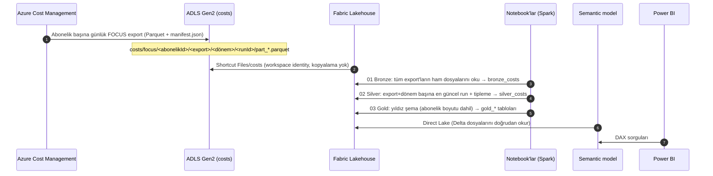
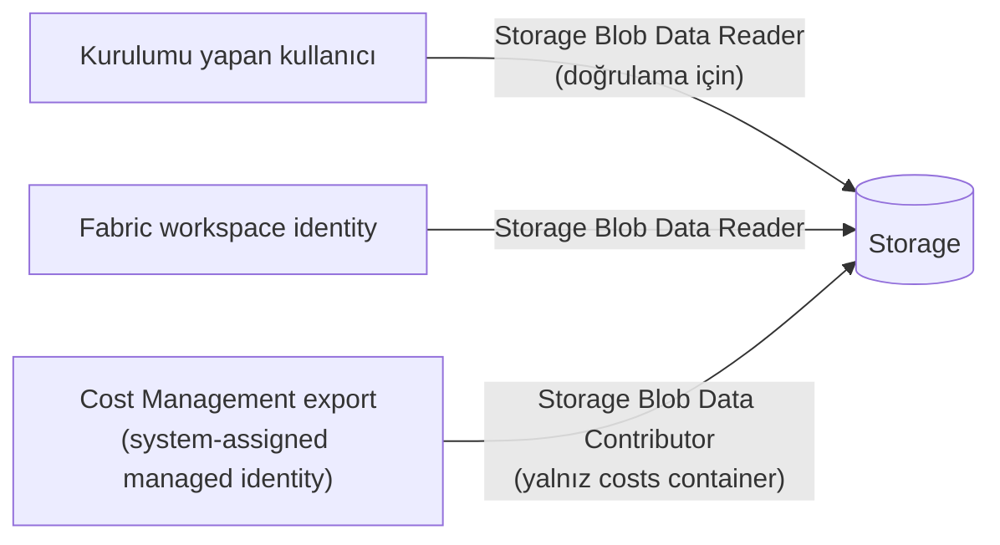

# 1. Mimari

## Amaç

Azure aboneliklerindeki (tek, birden fazla veya tüm fatura hesabı) **tüm servislerin** (VM, SQL, OpenAI, Storage, AKS, …) maliyetini:

1. her gün otomatik olarak toplamak,
2. tek bir standart şemaya (FOCUS) oturtmak,
3. Fabric'te Delta tablolarına dönüştürmek,
4. Power BI'da hazır ölçülerle raporlamak.

## Veri akışı

## Neden bu bileşenler?

| Karar | Gerekçe |
|---|---|
| **Cost Management Export** (API sorgusu yerine) | Ücretsiz, zamanlanmış, büyük hacimde güvenilir; Query API'nin rate-limit ve sayfalama sorunları yok |
| **FOCUS 1.0** veri seti | FinOps Foundation'ın açık standardı. Actual + amortized maliyeti, liste fiyatını ve rezervasyon/savings plan indirimlerini tek tabloda verir. İleride AWS/GCP verisiyle birleştirmek kolaylaşır |
| **Abonelik başına export, tek storage** | Tüm anlaşma türlerinde çalışır; her export `focus/<abonelikId>/` altına yazdığı için çakışmaz. EA/MCA'da alternatif olarak fatura hesabı kapsamında tek export kullanılabilir ([2.8](02-azure-cost-export.md#28-birden-fazla-abonelik)) |
| **Parquet + snappy** | CSV'ye göre ~10 kat küçük, tip bilgisi korunur, Spark'ta hızlı okunur |
| **ADLS Gen2 (HNS açık)** | OneLake shortcut'ı için hiyerarşik namespace gerekir |
| **OneLake shortcut** | Veriyi kopyalamadan Fabric'ten erişilir; tek kopya, tek gerçek |
| **Workspace identity** | Gizli anahtar/SAS yok; Fabric workspace'inin kendi Entra kimliği storage'a *Storage Blob Data Reader* olarak yetkilendirilir |
| **Medallion (Bronze/Silver/Gold)** | Ham veri korunur (yeniden işlenebilir), iş kuralları tek yerde (Silver), rapor dostu model (Gold) |
| **Direct Lake** | Import'un hızı + DirectQuery'nin güncelliği; veri kopyalanmaz, refresh saniyeler sürer |

## FOCUS nedir? En önemli kolonlar

FOCUS (FinOps Open Cost and Usage Specification), bulut sağlayıcıları arasında ortak bir maliyet şemasıdır. Bu çözümde kullanılan başlıca kolonlar:

| FOCUS kolonu | Anlamı | Silver'daki adı |
|---|---|---|
| `ChargePeriodStart` | Maliyetin ait olduğu gün | `charge_date` |
| `BilledCost` | Faturaya yansıyan tutar (rezervasyon satın alımı peşin görünür) | `billed_cost` |
| `EffectiveCost` | **Amortize** tutar: rezervasyon/savings plan maliyeti kullanıldığı günlere dağıtılır. Raporlamada ana ölçü budur | `effective_cost` |
| `ListCost` | İndirimsiz liste fiyatı → tasarruf hesabı için | `list_cost` |
| `ServiceName` / `ServiceCategory` | "Virtual Machines" / "Compute" gibi servis bilgisi | `service_name` / `service_category` |
| `ResourceId`, `ResourceName`, `x_ResourceGroupName` | Kaynak bilgisi | `resource_*` |
| `SubAccountId` / `SubAccountName` | Abonelik | `subscription_id` / `subscription_name` → `Subscription` boyutu |
| `ChargeCategory` | `Usage`, `Purchase`, `Tax`, `Credit`, `Adjustment` | `charge_category` |
| `PricingCategory` | `Standard` (PAYG), `Committed` (RI/SP), `Dynamic` (Spot) | `pricing_category` |
| `Tags` | JSON etiketler | `tags` + `tag_environment`, `tag_cost_center`, `tag_project` |

> **Hangi maliyet ölçüsünü kullanmalı?** Ekiplere/projelere maliyet dağıtımı için `EffectiveCost`; finans ekibinin faturasıyla mutabakat için `BilledCost`.

## Güvenlik modeli

- Hiçbir yerde hesap anahtarı veya SAS token saklanmaz; storage'da **paylaşılan anahtar erişimi kapalıdır** (`allowSharedKeyAccess: false`).
- Storage'da `allowBlobPublicAccess: false`, `minimumTlsVersion: TLS1_2`.
- Her export'un kendi **managed identity**'si vardır. Export oluşturulurken Cost Management bu kimliğe `costs` container'ında *Storage Blob Data Contributor* rolünü **kendisi** atar. Bunun için deploy eden kullanıcının storage üzerinde `Microsoft.Authorization/roleAssignments/write` yetkisi (Owner veya User Access Administrator) olmalıdır.
