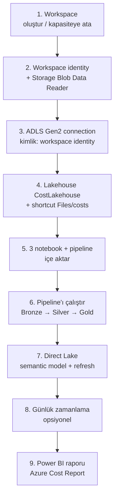

# 3. Fabric kurulumu

`scripts/setup_fabric.py`, Fabric tarafındaki her şeyi **Fabric REST API** ile kurar. Her adım *idempotent*tir: script'i tekrar çalıştırmak mevcut öğeleri yeniden kullanır, notebook'ları günceller.

## 3.1 Ön koşullar

| Gereksinim | Not |
|---|---|
| **Aktif** Fabric kapasitesi (F2+ ya da Trial) | Duraklatılmış (Paused) kapasite ile workspace'e item oluşturulamaz. Portal → *Microsoft Fabric capacity* → **Resume** |
| Kapasitede *Contributor* izni | Workspace'i kapasiteye atamak için |
| Fabric tenant ayarı: *Users can create Fabric items* | Varsayılan olarak açık |
| Abonelikte storage üzerinde rol atama yetkisi | Workspace identity'ye *Storage Blob Data Reader* vermek için |
| `az login` | Script Azure CLI token'ını kullanır (hem Fabric hem ARM için) |
| Adım 2'nin tamamlanmış olması | `.azure-outputs.json` dosyası storage bilgilerini sağlar |

```powershell
python -m pip install -r scripts/requirements.txt
python scripts/setup_fabric.py --capacity-name senem2fabric --schedule-time 06:00
```

## 3.2 Script ne yapıyor?



| Adım | API | Açıklama |
|---|---|---|
| **1. Workspace** | `GET /capacities`, `POST /workspaces`, `POST /workspaces/{id}/assignToCapacity` | Kapasite adla veya ID ile bulunur, **Active** olması kontrol edilir. Workspace yoksa oluşturulur |
| **2. Workspace identity** | `POST /workspaces/{id}/provisionIdentity` + ARM `PUT roleAssignments` | Workspace'e bir Entra servis sorumlusu verilir ve storage hesabında *Storage Blob Data Reader* atanır |
| **3. Connection** | `POST /connections` | `AzureDataLakeStorage` tipinde, `server = https://<hesap>.dfs.core.windows.net`, `path = costs`, kimlik `WorkspaceIdentity`. Fabric bağlantıyı oluştururken test eder; RBAC yayılımı ~1–5 dk sürebildiği için script 30 sn aralıklarla tekrar dener |
| **4. Lakehouse + shortcut** | `POST /lakehouses`, `POST /items/{id}/shortcuts` | `CostLakehouse` (şema destekli). `Files/costs` shortcut'ı ADLS'teki `costs` container'ını gösterir — **veri kopyalanmaz** |
| **5. Notebook + pipeline** | `POST /items` (definition: base64 ipynb / pipeline JSON) | Notebook'lar varsayılan lakehouse'a bağlanır. Pipeline JSON'undaki notebook adları gerçek ID'lerle değiştirilir |
| **6. İlk çalıştırma** | `POST /items/{id}/jobs/instances?jobType=Pipeline` | İş tamamlanana kadar `Location` URL'i yoklanır (ilk çalışmada Spark oturumu açılışı ~2–4 dk) |
| **7. Semantic model** | `POST /semanticModels` (model.bim + definition.pbism), `POST .../refreshes` | Lakehouse SQL endpoint metadata'sı yenilenir, Direct Lake model oluşturulur ve refresh edilir |
| **8. Zamanlama** | `POST /items/{id}/jobs/Pipeline/schedules` | `--schedule-time 06:00` → her gün 06:00 UTC'de pipeline çalışır (export genelde gece biter) |
| **9. Rapor** | `POST /items` (type `Report`, PBIR definition) | `fabric/report/` klasöründeki rapor, `definition.pbir` içindeki `{{SEMANTIC_MODEL_ID}}` modelin ID'siyle değiştirilerek yayımlanır. Sayfa içeriği: [05-power-bi-rapor.md §5.2](05-power-bi-rapor.md#52-hazır-rapor-azure-cost-report) |

Sonunda `.fabric-outputs.json` dosyasına workspace, lakehouse, pipeline, notebook, model ve rapor ID'leri yazılır (önceki çalıştırmanın değerleriyle birleştirilir).

## 3.3 Parametreler

| Parametre | Varsayılan | Açıklama |
|---|---|---|
| `--capacity-name` / `--capacity-id` | — (zorunlu) | Hedef Fabric kapasitesi |
| `--workspace-name` | `Azure Cost Analytics` | Workspace adı |
| `--storage-account` | `.azure-outputs.json`'dan | Farklı/mevcut bir storage hesabı kullanmak için |
| `--connection-id` | — | Önceden oluşturulmuş bir bağlantıyı kullan; 2. ve 3. adımlar atlanır |
| `--skip-run` | kapalı | Pipeline'ı çalıştırma |
| `--skip-semantic-model` | kapalı | Semantic model oluşturma |
| `--schedule-time` | — | Günlük çalışma saati (UTC, `HH:MM`) |
| `--skip-report` | kapalı | Power BI raporunu yayımlama |

> **Yarıda kalırsa:** Script idempotenttir; var olan öğeleri yeniden kullanır. Bağlantı oluştuysa tekrar çalıştırırken `.fabric-outputs.json` içindeki `connection_id`'yi verin ve pipeline zaten çalıştıysa `--skip-run` ekleyin:
> `python scripts/setup_fabric.py --capacity-name <kapasite> --connection-id <guid> --skip-run --schedule-time 06:00`
>
> **Sadece raporu (yeniden) yayımlamak için:**
> `python scripts/setup_fabric.py --capacity-name <kapasite> --connection-id <guid> --skip-run --skip-semantic-model`

## 3.4 Manuel alternatif: bağlantıyı portaldan oluşturma

Kuruluşunuzda workspace identity kullanılamıyorsa (ör. tenant ayarı kapalı) bağlantıyı elle oluşturup ID'sini verebilirsiniz:

1. Fabric → ⚙️ **Settings** → **Manage connections and gateways** → **+ New** → **Cloud**.
2. Connection type: **Azure Data Lake Storage Gen2**
   - URL: `https://<storage>.dfs.core.windows.net`
   - Full path: `costs`
   - Authentication: **Organizational account** (OAuth) veya **Service principal**
3. Oluşturduktan sonra **Settings** panelinden *Connection ID*'yi kopyalayın.
4. Script'i şu şekilde çalıştırın:

```powershell
python scripts/setup_fabric.py --capacity-name <kapasite> --connection-id <guid>
```

> OAuth kullanıyorsanız, bağlantıyı oluşturan kullanıcının storage üzerinde *Storage Blob Data Reader* rolü olmalıdır (`01-deploy-azure.ps1` bunu otomatik verir).

## 3.5 Manuel alternatif: tüm adımlar portaldan

| Adım | Portal yolu |
|---|---|
| Lakehouse | Workspace → **+ New item** → **Lakehouse** → ad `CostLakehouse`, *Lakehouse schemas* işaretli |
| Shortcut | Lakehouse → **Files** → `…` → **New shortcut** → **Azure Data Lake Storage Gen2** → bağlantıyı seç → `costs` klasörünü işaretle |
| Notebook'lar | Workspace → **Import** → **Notebook** → `fabric/notebooks/*.ipynb` → her notebook'ta sol panelden `CostLakehouse`'u varsayılan yap |
| Pipeline | **+ New item** → **Data pipeline** → 3 adet **Notebook** aktivitesi ekleyip *On success* ile sırayla bağla |
| Semantic model | Lakehouse → **New semantic model** → `gold_*` tablolarını seç → ilişki ve ölçüleri [05-power-bi-rapor.md](05-power-bi-rapor.md)'deki gibi ekle |

## 3.6 Workspace'te ne göreceksiniz?

```
Azure Cost Analytics (workspace)
├── CostLakehouse                    Lakehouse
│   ├── Files/costs  ⤴ (shortcut)
│   └── Tables/dbo/
│       ├── bronze_costs
│       ├── silver_costs
│       ├── gold_fact_cost_daily
│       ├── gold_dim_resource / gold_dim_service / gold_dim_date
│       └── gold_cost_monthly
├── CostLakehouse                    SQL analytics endpoint
├── 01_bronze_costs / 02_silver_costs / 03_gold_costs    Notebook
├── Cost Refresh Pipeline            Data pipeline
└── Azure Cost Model                 Semantic model (Direct Lake)
```
