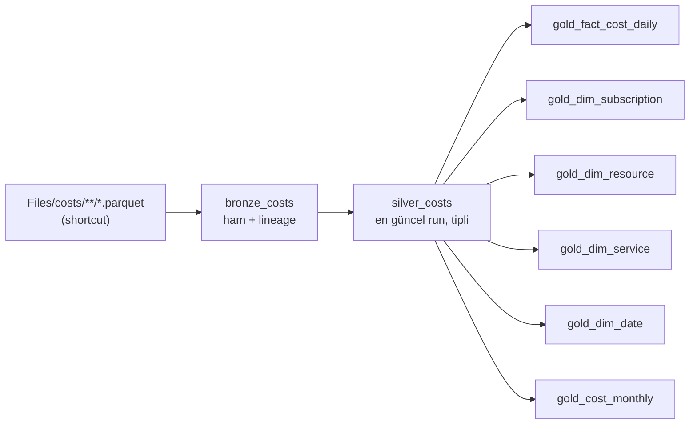

# 4. Medallion notebook'ları

Üç notebook `fabric/notebooks/` altındadır ve **Cost Refresh Pipeline** tarafından sırayla çalıştırılır. Aynı mantığın pandas karşılığı `local-demo/run_local_pipeline.py` içindedir. Böylece Spark/Fabric olmadan da test edilebilir.



## 4.1 `01_bronze_costs` — Ham veri

**Amaç:** Export dosyalarını *hiç değiştirmeden* Delta tablosuna almak. Böylece iş kuralı değişirse Silver/Gold yeniden üretilebilir.

| İşlem | Detay |
|---|---|
| Okuma | `Files/costs` altı `recursiveFileLookup` ile taranır (tüm abonelik klasörleri dahil), `pathGlobFilter = *.parquet` ile `manifest.json` gibi dosyalar atlanır |
| Kolon adları | Delta'da geçersiz karakterler (`boşluk , ; { } ( ) = \n \t`) `_` ile değiştirilir |
| Lineage | `_source_file` (dosya yolu), `_file_modification_time`, `_ingestion_timestamp` |
| Yazma | `overwrite` + `overwriteSchema` → her çalıştırma tüm export'u yeniden okur |

> **Neden her seferinde overwrite?** Bir aboneliğin export'u genelde ayda birkaç MB'tır; onlarca abonelikte bile tam yeniden okuma, incremental mantığa göre çok daha basit ve hatasızdır. Çok büyük EA/MCA hesaplarında (GB'lar) dönem bazlı `replaceWhere` kullanılabilir.

## 4.2 `02_silver_costs` — Temiz, tekil maliyet kayıtları

### a) Çift sayımı önleme (en kritik adım)

Her export run'ı **ayın başından o güne kadar olan tüm veriyi** içerir. Aynı ay için birden fazla run klasörü varsa (manuel çalıştırma, overwrite kapalı, geçiş dönemi…) bunları toplamak maliyeti katlar.

```
20261001-20261031/
├── acf857ee/  →  1–7 Ekim   (dünkü run)     ✗ atılır
└── d092a721/  →  1–14 Ekim  (bugünkü run)   ✓ tutulur
```

Silver, dosya yolundan **export klasörü**, **fatura dönemi** ve **run ID**'yi çıkarır; her *(export klasörü, dönem)* çifti için en yeni dosya zamanına sahip run'ı seçer:

```python
.withColumn("_export_path",    F.regexp_extract("_source_file", r"^(.*)/\d{8}-\d{8}/", 1))
.withColumn("_billing_period", F.regexp_extract("_source_file", r"/(\d{8}-\d{8})/", 1))
.withColumn("_export_run",     F.regexp_extract("_source_file", r"/\d{8}-\d{8}/([^/]+)/", 1))
# RUN_KEY = ["_export_path", "_billing_period"] başına max(_file_modification_time) → row_number() = 1
```

> **Neden `_export_path` da anahtarda?** Birden fazla abonelikte her abonelik kendi export'unu (`focus/<abonelikId>/focus-daily-demo/`) yazar. Anahtar yalnızca dönem olsaydı, o ay en son çalışan aboneliğin run'ı "en güncel" sayılır ve **diğer aboneliklerin tüm verisi atılırdı**. Yerel demo bu farkı ekrana yazdırır.

> Satır bazında `dropDuplicates` **yapılmaz**: FOCUS'ta birebir aynı görünen iki satır meşru olabilir (ör. aynı kaynağın iki ayrı meter'ı). Tekrarlar yalnızca eski run'lardan gelir.

### b) Sabit kolon sözleşmesi

`pick()` fonksiyonu kolon adlarını büyük/küçük harf duyarsız eşler ve alternatif adları dener (ör. `x_ResourceGroupName` → `ResourceGroupName` → kaynak ID'sinden çıkarma). Böylece FOCUS sürümü veya hesap türü değişse de Silver şeması sabit kalır.

### c) Etiketler (tags)

- Eski export'larda `"env": "prod"` gibi dış süslü parantezsiz JSON gelir; parantez eklenir.
- JSON → `map<string,string>`, anahtarlar küçük harfe çevrilir (`Environment` = `environment`).
- Sık kullanılan etiketler ayrı kolon olur:

| Kolon | Aranan etiket anahtarları |
|---|---|
| `tag_environment` | `environment`, `env` |
| `tag_cost_center` | `costcenter`, `cost-center`, `cost_center` |
| `tag_project` | `project`, `application`, `app` |

Kendi etiket standardınız farklıysa `02_silver_costs` notebook'undaki bu satırları düzenleyin.

## 4.3 `03_gold_costs` — Power BI için yıldız şema

| Tablo | Tanecik (grain) | Önemli kolonlar |
|---|---|---|
| `gold_fact_cost_daily` | gün × abonelik × kaynak × servis × meter × charge/pricing kategorisi | `subscription_id`, `billed_cost`, `effective_cost`, `list_cost`, `savings`, `consumed_quantity`, `line_items` |
| `gold_dim_subscription` | abonelik | `subscription_id`, `subscription_name`, `billing_account_name` |
| `gold_dim_resource` | kaynak | `resource_name`, `resource_type`, `resource_group`, `subscription_name`, `region`, `tag_*` |
| `gold_dim_service` | servis | `service_name`, `service_category` |
| `gold_dim_date` | gün (tam takvim yılları) | `year`, `quarter`, `month_name`, `year_month`, `day_name`, `is_weekend` |
| `gold_cost_monthly` | ay × abonelik × servis | `effective_cost`, `previous_month_cost`, `mom_change`, `mom_change_pct`, `ytd_cost` |

Notlar:

- Kaynağı olmayan satırlar (rezervasyon satın alma, destek planı, vergi) `resource_key = 'unassigned/<abonelikId>'` alır ve `gold_dim_resource`'ta **"(no resource)"** olarak görünür. Abonelik başına ayrı anahtar sayesinde bu maliyetler de doğru aboneliğe bağlı kalır; toplamlar kaybolmaz.
- Para kolonları `decimal(18,4)` tipindedir (Power BI'da yuvarlama hatası olmaz).
- `gold_dim_date`, verinin kapsadığı yılların **tamamını** içerir (Power BI time-intelligence fonksiyonları kesintisiz tarih tablosu ister).
- Notebook sonunda **mutabakat kontrolü** yapılır: `sum(silver.effective_cost) == sum(gold_fact.effective_cost)`, aksi hâlde notebook hata verir ve pipeline durur.

## 4.4 Pipeline

`fabric/pipelines/pipeline_cost_refresh.json`:

```
01 Bronze ──(başarılı)──▶ 02 Silver ──(başarılı)──▶ 03 Gold
```

Bir adım başarısız olursa sonrakiler çalışmaz; Gold tabloları ve rapor bir önceki (tutarlı) hâlde kalır.

## 4.5 Yerelde test

```powershell
cd local-demo
.\.venv\Scripts\python generate_sample_focus.py --months 3
.\.venv\Scripts\python run_local_pipeline.py
```

Çıktı, Fabric'teki tablolarla aynı isim ve kolonlara sahip Parquet dosyalarıdır (`local-demo/output/{bronze,silver,gold}`).
