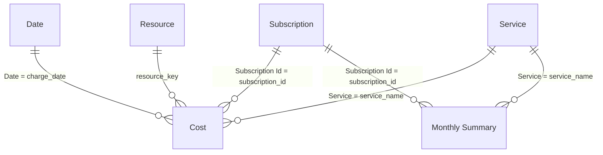

# 5. Power BI raporu

## 5.1 Semantic model: "Azure Cost Model"

`setup_fabric.py`, `fabric/semantic-model/model.bim.json` dosyasından **Direct Lake** modunda bir semantic model oluşturur. Direct Lake'te Power BI, Lakehouse'taki Delta dosyalarını doğrudan belleğe alır: import gibi hızlıdır, ancak veri kopyalanmaz ve pipeline bittiğinde rapor otomatik güncellenir.



| Model tablosu | Kaynak Delta tablosu | Rol |
|---|---|---|
| **Cost** | `gold_fact_cost_daily` | Fact; tüm ölçüler burada |
| **Date** | `gold_dim_date` | *Mark as date table* yapılmış takvim |
| **Subscription** | `gold_dim_subscription` | Abonelik adı/ID'si ve fatura hesabı. Çoklu abonelikte ana filtre |
| **Resource** | `gold_dim_resource` | Kaynak, RG, bölge, etiketler |
| **Service** | `gold_dim_service` | Servis ve kategori |
| **Monthly Summary** | `gold_cost_monthly` | Önceden hesaplanmış aylık MoM/YTD (DAX'sız hızlı tablo) |

### Hazır DAX ölçüleri (`Cost` tablosunda)

| Ölçü | DAX | Ne için |
|---|---|---|
| Effective Cost | `SUM('Cost'[effective_cost])` | **Ana ölçü**: amortize maliyet |
| Billed Cost | `SUM('Cost'[billed_cost])` | Fatura mutabakatı |
| List Cost | `SUM('Cost'[list_cost])` | İndirimsiz fiyat |
| Savings / Savings % | `[List Cost] - [Effective Cost]` | RI / Savings Plan / indirim kazancı |
| Effective Cost MTD / YTD | `TOTALMTD` / `TOTALYTD` | Ay/yıl başından bugüne |
| Effective Cost PM | `CALCULATE([Effective Cost], DATEADD('Date'[Date], -1, MONTH))` | Önceki ay |
| MoM Change / MoM Change % | `[Effective Cost] - [Effective Cost PM]` | Aylık değişim |
| Avg Daily Cost | `AVERAGEX(VALUES('Date'[Date]), [Effective Cost])` | Günlük ortalama (boş günler hariç) |
| Resource Count | `DISTINCTCOUNT` (`unassigned/…` hariç) | Maliyet üreten kaynak sayısı |
| Subscription Count | `DISTINCTCOUNT('Cost'[subscription_id])` | Maliyet üreten abonelik sayısı |
| Line Items | `SUM('Cost'[line_items])` | Kaynak satır sayısı |

## 5.2 Raporu oluşturma (adım adım)

1. Fabric workspace → **Azure Cost Model** → `…` → **Create report** (veya Power BI Desktop → *OneLake data hub* → modeli seç → **Connect**).
2. Aşağıdaki sayfa düzenini kurun. `local-demo/output/cost_report.html` aynı görsellerin önizlemesidir.

### Sayfa 1 — Genel bakış

| # | Görsel | Alanlar |
|---|---|---|
| 1 | **Card** ×4 | `Effective Cost MTD`, `Effective Cost PM`, `MoM Change %`, `Savings` |
| 2 | **Stacked area / column chart** — Günlük trend | X: `Date[Date]`, Y: `Effective Cost`, Legend: `Service[Service Category]` |
| 3 | **Bar chart** — Servise göre | Y: `Service[Service]`, X: `Effective Cost` (azalan sırala) |
| 4 | **Donut** ×2 | Legend: `Subscription[Subscription]` ve `Resource[Resource Group]`, Values: `Effective Cost` |
| 5 | **Slicer**'lar | `Date[Year Month]`, `Subscription[Subscription]`, `Resource[Environment (tag)]` |

### Sayfa 2 — Kaynak detayı

| # | Görsel | Alanlar |
|---|---|---|
| 1 | **Table** — Top 10 kaynak | `Resource[Resource]`, `Resource[Resource Type]`, `Resource[Resource Group]`, `Effective Cost`, `MoM Change %` → *Top N filter = 10 by Effective Cost* |
| 2 | **Matrix** — Etiket bazlı dağıtım (showback) | Rows: `Resource[Cost Center (tag)]`, `Resource[Project (tag)]`; Columns: `Date[Year Month]`; Values: `Effective Cost` |
| 3 | **Treemap** | Group: `Resource[Resource Type]`, Values: `Effective Cost` |

### Sayfa 3 — Aylık trend ve tasarruf

| # | Görsel | Alanlar |
|---|---|---|
| 1 | **Clustered column** | X: `Date[Year Month]`, Y: `Effective Cost`, Legend: `Service[Service]` |
| 2 | **Table** — Aylık özet | `Monthly Summary` tablosundaki kolonlar (abonelik × servis; `Subscription[Subscription]` ile birlikte) |
| 3 | **Line and clustered column** | X: `Date[Year Month]`, Columns: `List Cost`, `Effective Cost`; Line: `Savings %` |
| 4 | **Bar** | Y: `Cost[Pricing Category]`, X: `Effective Cost` (PAYG vs Reservation/Savings Plan) |

> **İpucu:** `Date[Year Month]` kolonunun *Sort by column* ayarı `Year Month Sort` olarak hazır gelir; aylar kronolojik sıralanır.

## 5.3 Ek fikirler

- **Anomali tespiti:** Günlük trend çizgisinde *Analytics → Find anomalies* açın. Örnek veride 14–16. günlerdeki Azure OpenAI artışı otomatik işaretlenir.
- **Bütçe:** Bir `Budget` tablosu (ay × servis × hedef) ekleyip `Effective Cost` ile karşılaştırın.
- **Uyarılar:** Rapordaki bir kartı **Set alert** ile Data Activator'a bağlayıp eşik aşımında Teams/e-posta bildirimi gönderin.
- **Copilot:** Model, Copilot for Power BI ile "Geçen aya göre en çok artan 5 servis hangisi?" gibi sorulara hazırdır.

## 5.4 Doğrulama

Fabric'te **SQL analytics endpoint** üzerinden mutabakat:

```sql
SELECT FORMAT(f.charge_date,'yyyy-MM') AS ay, s.subscription_name, SUM(f.effective_cost) AS effective_cost
FROM dbo.gold_fact_cost_daily f
JOIN dbo.gold_dim_subscription s ON s.subscription_id = f.subscription_id
GROUP BY FORMAT(f.charge_date,'yyyy-MM'), s.subscription_name
ORDER BY ay, s.subscription_name;
```

Sonuçları Azure portal → **Cost Management → Cost analysis** (View: *Amortized cost*, Granularity: *Monthly*, Scope: ilgili abonelik veya management group) ile karşılaştırın. Küçük farklar normaldir: portal son 72 saati henüz kesinleşmemiş verilerle gösterir, export ise bir sonraki çalışmasında günceller.
